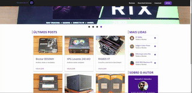

<h1 align="center">
    
</h1>

<h3 align="center">
   <a href="https://projeto-tocp.netlify.app/">Deploy</a>
</h3>

<h4 align="center"> 
	Status: Finalizado ✅
</h4>

# Indice

- [Sobre](#-sobre)
- [Tecnologias Utilizadas](#-Tecnologias-utilizadas)
- [Como baixar o projeto](#-Como-baixar-o-projeto)

## 📋 Sobre

Um projeto de pagina inicial alternativa do **[tOCP](https://theoverclockingpage.com/)**, criado com o objetivo de exercitar os conhecimentos adquiridos no semestre.

---


## 🚀 Tecnologias utilizadas

O projeto foi desenvolvido utilizando as seguintes tecnologias 

- [HTML](https://www.w3schools.com/html/)
- [CSS](https://www.w3schools.com/css/)
- [JavaScript](https://www.javascript.com/)
- [Materialize](https://materializecss.com/)
- [jQuery](https://jquery.com/)

---

## 📁 Como baixar o projeto

```bash

    # Clonar o repositório
    $ git clone https://github.com/orlandolilo/theoverclockingpage
    
```